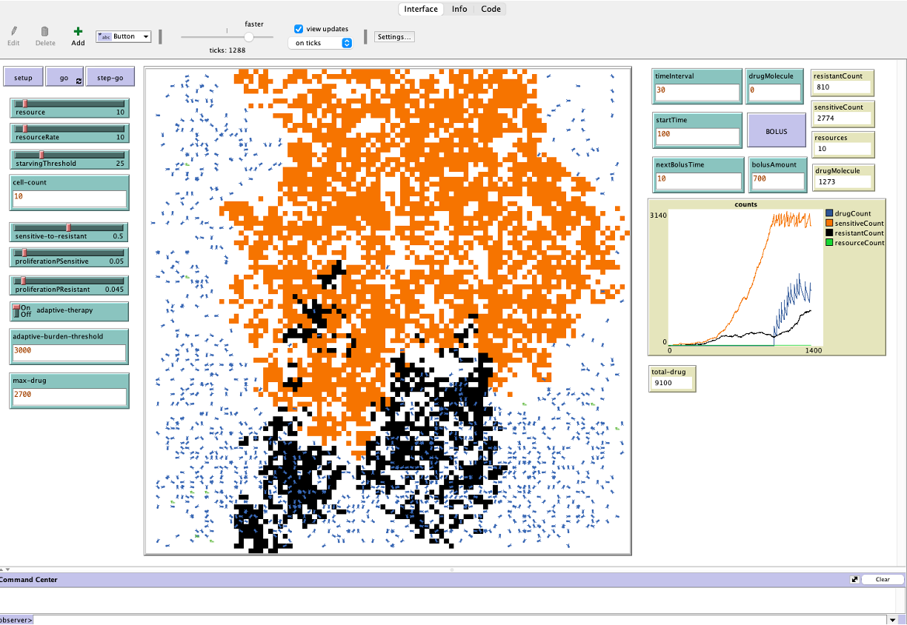

# Modeling Adaptive Therapy
NetLogo model for adaptive therapy in cancer

## Agents
- Resource (Green turtles)
- Cancer cells
  - Sensitive cells (Orange patches)
  - Resistant cells (Black patches)
- Drug molecule (Blue turtles)

## Parameters
- Resource count
- Resource rate
- Starving threshold
- Cell count
- Sensitive to Resistant ratio
- Probability of Proliferation of Sensitive Cells
- Probability of Proliferation of Resistant Cells
- Drug molecule
- Start time of therapy
- Time interval
- Bolus amount  
- Bolus time
- Adaptive burden threshold
- Drug threshold

## Stopping criteria:
- Tumor shrinks and no cells left
- Tumor grows to more than 90% of the available area

## Interface

